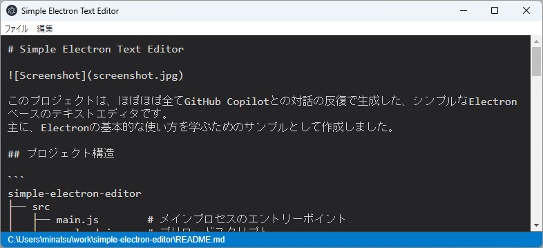

# Simple Electron Text Editor



This project is a simple Electron-based text editor generated almost entirely through iterative interaction with GitHub Copilot.
It was created primarily as a sample for learning basic Electron usage.

## Project Structure

```
simple-electron-editor
├── src
│   ├── main.js        # Main process entry point
│   ├── preload.js     # Preload script
│   ├── renderer.js    # Renderer process script
│   ├── index.html     # HTML structure for the main window
│   └── styles
│       └── main.css   # Stylesheet for the application
└── package.json       # npm configuration file
```

## Getting Started

To get started with the Simple Electron Text Editor, follow these steps:

1. **Clone the repository:**
   ```
   git clone https://github.com/MinatsuT/simple-electron-editor.git
   cd simple-electron-editor
   ```

2. **Install dependencies:**
   ```
   npm install
   ```

3. **Run the application:**
   ```
   npm start
   ```

## Features

- Create and edit text files
- Simple and intuitive user interface
- Save and overwrite files
- Open files via drag & drop
- Warning for unsaved changes
- Status bar displaying filename and modification state

## Keyboard Shortcuts

- `Ctrl+N` / `Cmd+N` - Create new file
- `Ctrl+O` / `Cmd+O` - Open file
- `Ctrl+S` / `Cmd+S` - Save file
- `Ctrl+Shift+S` / `Cmd+Shift+S` - Save as

## Build Instructions

To build the application for different platforms:

- **Build for the platform in use:**
  ```
  npm run build
  ```

- **Build for Windows:**
  ```
  npm run build:windows
  ```

- **Build for Mac:**
  ```
  npm run build:mac
  ```

- **Build for Linux:**
  ```
  npm run build:linux
  ```

The built applications will be output to the dist directory.

## License

This project is licensed under the MIT License.